# University-Market Alignment Analysis

## 1. Background

This project addresses a key policy concern for MOM and MOE: whether university curricula are keeping pace with Singapore's labour market. Despite fairly strong labour market conditions, weaker graduate employment outcomes suggest that the issue goes beyond job availability to include how well graduates' skills align with employer demand. As labour demand trends evolve, there remains no comprehensive, data-driven framework to assess how well universities are supplying skills demanded by the labour market in real time, limiting effective policy intervention.

### 1.1 Objective

To develop a data-driven framework to evaluate how well university curricula align with labour market demand at both the system-wide and degree-specific levels.

### 1.2 Research Questions

This study addresses the overarching question: 

**How well are universities preparing students for real-world jobs?**

To answer this, the analysis is conducted at two levels:

- **Macro-level:** To what extent are skills demanded by the job market covered by university modules today?
- **Micro-level:** Which degrees demonstrate the strongest broad-market and intended-industry alignment?

## 2. Problem Scope 

This study focuses on Singapore's public university sector, focusing on NUS, SMU and SUTD, due to sufficiently accessible module information. For the micro-level analysis, 21 full-time undergraduate degree programmes with [Graduate Employment Survey (GES) 2025](https://www.moe.gov.sg/api/media/a43cdd0b-4f2d-44f8-a98c-7ff48a7670ac/Web-Publication-NUS-GES-2025.pdf) response rates of at least 65% were further selected. For NUS, the highest and lowest five performing degree programmes by full-time permanent employment were included to preserve variation in employment outcomes, keep the analysis tractable, and enable clear comparison within a larger institution.

These scoping choices define the study's boundaries: it measures current alignment rather than curriculum change over time, focuses on full-time graduate employment in the local job market, and treats module descriptions as proxies for taught skills.

### 2.1 Success Criteria

Success is defined by whether the framework produces technically credible and policy-relevant evidence that can support curriculum review and higher education planning.

- **Policy Goal:** provide a clear, data-driven view of how well university degrees align with labour market demand, highlighting key skill gaps and cross-programme differences.
- **Operational Goal:** develop a reproducible framework that compares module content with job market demand and produces interpretable alignment measures that can support curriculum review.

## 3. Data and Methodology

### 3.1 Data Sources

This study uses two main data sources: 

- Job postings between 25 January 2026 to 31 January 2026 from MyCareersFuture
- University module data from NUS, SMU, and SUTD

Job postings capture labour market skill demand, while university module data capture the skills supplied through curricula.

### 3.2 Data Collection and Processing

#### 3.2.1 University Modules

NUS module data were retrieved from the [NUSMods API](https://api.nusmods.com/v2) for academic year 2025-2026. [SMU](https://modules.smu.edu.sg) and [SUTD](https://sutd.edu.sg/education/undergraduate/modules) module data were collected from their official module listings using Playwright and Beautifulsoup respectively.

#### 3.2.2 MyCareersFuture Jobs

Job posting data was sourced from 22,720 JSON files, each representing one listing. Files were extracted from a compressed archive and processed in parallel using ThreadPoolExecutor. 

For each job posting, the following fields were extracted:

- **uuid** — unique job identifier
- **title** — job title
- **description** — full job description 
- **minimumYearsExperience** — minimum experience required
- **skills** — list of required skills
- **employmentTypes** — employment type (e.g. full-time, contract)
- **ssicCode** — occupational and qualification classification codes

Raw job descriptions were stored in HTML and cleaned by removing HTML tags with BeautifulSoup, removing emojis with Unicode regex, and normalising whitespace. The dataset was then filtered to retain only full-time, permanent, and contract postings, yielding a final corpus of **16,686 job postings**.

### 3.3 Semantic Representation 

All text-based comparisons in this study use the same semantic representation pipeline. Job descriptions, job-demanded skills and university module descriptions were embedded using **all-mpnet-base-v2** and saved as `10_nus_modules_embedded.parquet`, `all_smu_modules_embedded.parquet`, and `all_sutd_modules_embedded.parquet`. Semantic closeness was measured using **cosine similarity** in a shared embedding space, ensuring methodological consistency and providing a scalable way to compare curriculum and labour market text.

### 3.4 Topic Modelling

To map the job market landscape, **BERTopic** was applied to the 16,686 filtered job postings. UMAP and HDBSCAN hyperparameters were jointly optimised with **Optuna** over 5 trials, maximising coherence while penalising outlier ratios. The selected configuration (`n_neighbors=45`, `n_components=3`, `min_cluster_size=18`) produced **157 job clusters**, with 5,187 postings classified as outliers.

Topic representations were further refined using **KeyBERTInspired** and **Maximal Marginal Relevance** to ensure that representative keywords were both semantically relevant within each cluster.

```python
representation_model = [KeyBERTInspired(), MaximalMarginalRelevance(diversity=0.8)]
```

**Figure 1** shows topics being well-distributed across the 2D projection space, with circle sizes reflecting job volume. Notably, the large cluster of tightly grouped circles suggests semantically related roles, while isolated circles represent niche domains which confirms the model's ability to capture a broad and diverse job market taxonomy.

**Figure 2** validates the semantic coherence of individual topics. Each topic exhibits clearly distinct, high scoring keywords. These topics are then used as the job market benchmark for evaluating university modules.

<div align="center" markdown="1">

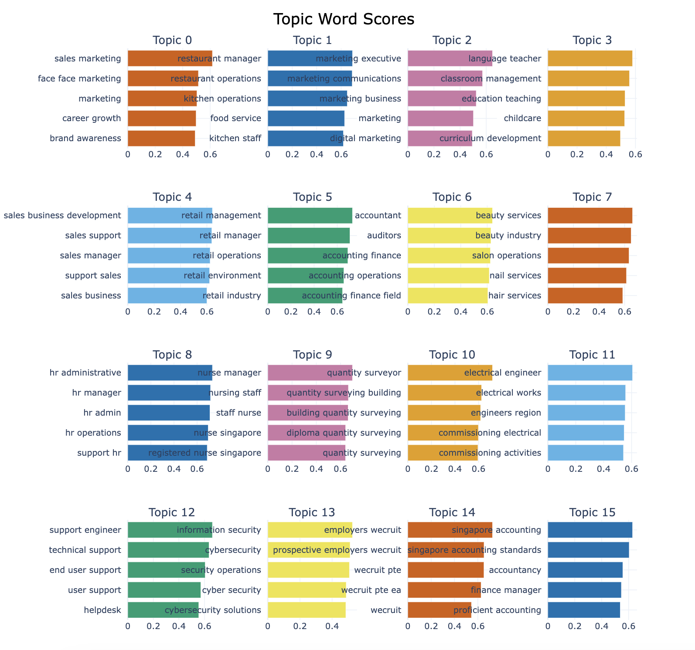

**Fig 1. Topic Word Scores**

</div>

<div align="center" markdown="1">

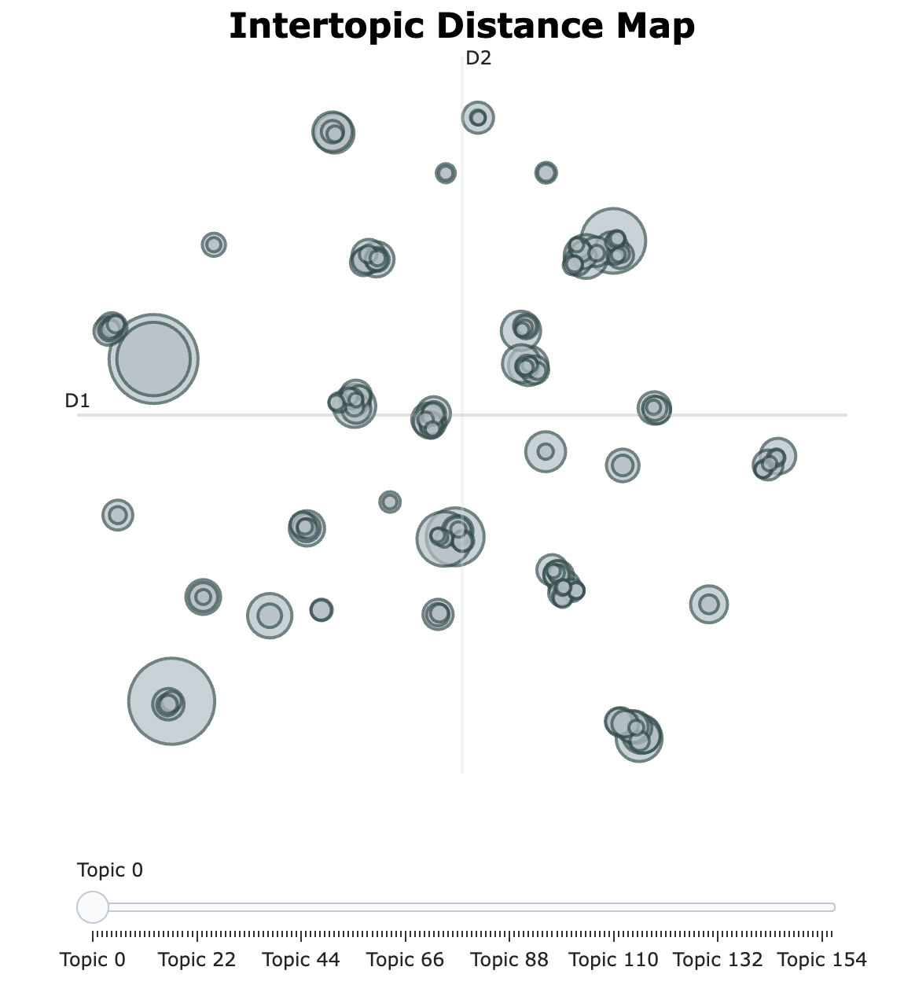

**Fig 2. Intertopic Distance Map**

</div>

Modules were embedded using the same model, then assigned to BERTopic clusters. For each degree, all modules' assigned clusters identify relevant jobs. Cosine similarity between module and job embeddings produces final rankings using composite scores (40% cluster breadth, 40% average similarity, 20% max similarity), balancing curriculum-wide relevance with specialization depth.

## 4. Macro Question

Section 4 addresses: 

**To what extent are skills demanded by the job market covered by university modules today?**

### Rationale

This section provides a system-wide assessment of how well university curricula cover job-demanded skills. As MOE seeks to assess whether the public university sector sufficiently equips students with these skills, institution-level analysis alone may overlook complementarities across universities.

### System-Wide Skill Coverage Analysis

Using Section 3.3's shared semantic representation, deduplicated job-demanded skills were compared against skill embeddings of each university and a pooled all-schools set. A demanded skill was considered **covered** if its cosine similarity to at least one supplied skill exceeded **0.55**. 

Two measures were computed: 

- **Deduplicated coverage**, which considers unique demanded skills; and
- **Non-deduplicated coverage**, which weighs demanded skills by their frequency across job postings.

Coverage was then analysed at three levels: 

1. System-wide skills coverage
2. Job-level deduplicated coverage distribution
3. Demand-supply gaps for highly demanded skills

<div align="center" markdown="1">

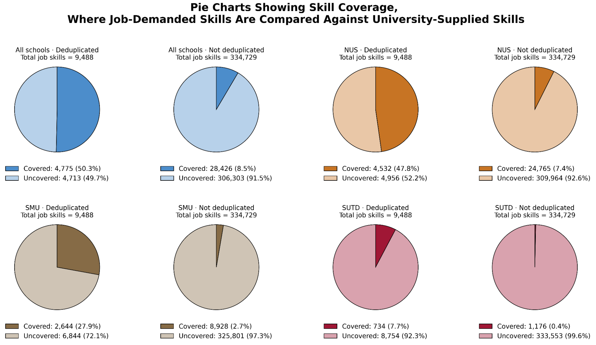

**Figure 3. Skill Coverage Pie Charts**

</div>

**Deduplicated coverage (50.3%)** is much higher than **non-deduplicated coverage (8.5%)**, suggesting that universities cover a reasonable range of skills but not the ones most demanded. NUS records the highest coverage on both measures, likely reflecting its broader disciplinary scope, but no university performs strongly enough on its own to close the gap. 

### Job-Level Deduplicated Skill Coverage Distribution Analysis

Job-level coverage was then computed as the proportion of a posting's unique demanded skills that were covered. 

<div align="center" markdown="1">

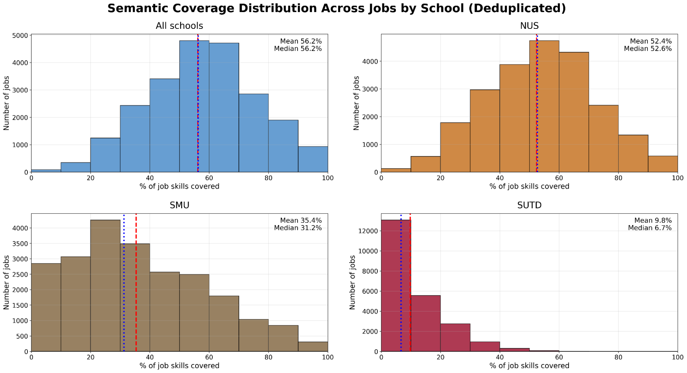

**Figure 4. Job-Level Skill Coverage Histograms**

</div>

Across all three universities, the mean and median job-level coverage are both **56.2%**, indicating moderate coverage per job posting. NUS again records the highest and most consistent job-level coverage, with a mean and median of 52.4% and 52.6% respectively, followed by SMU and SUTD which show lower and more uneven performance across jobs. 

### Demand-Supply Gaps Analysis

For each demanded skill, the **skill gap** was defined as the difference between job demand and university supply. 

<div align="center" markdown="1">

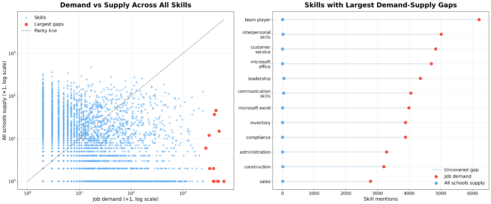

**Figure 5. Demand-Supply Gap Scatter Plot and Dumbbell Plot**

</div>

University skill supply is generally well below job market demand, with most points falling below the parity line, suggesting that the issue is not just teaching these skills, but teaching them at sufficient scale. The largest gaps are concentrated in broad, transferable skills like teamwork, interpersonal skills, and customer service, rather than narrow technical skills.

We then focused on the twelve most in-demand skills, expressing university skill supply as a percentage of job market demand. 

<div align="center" markdown="1">

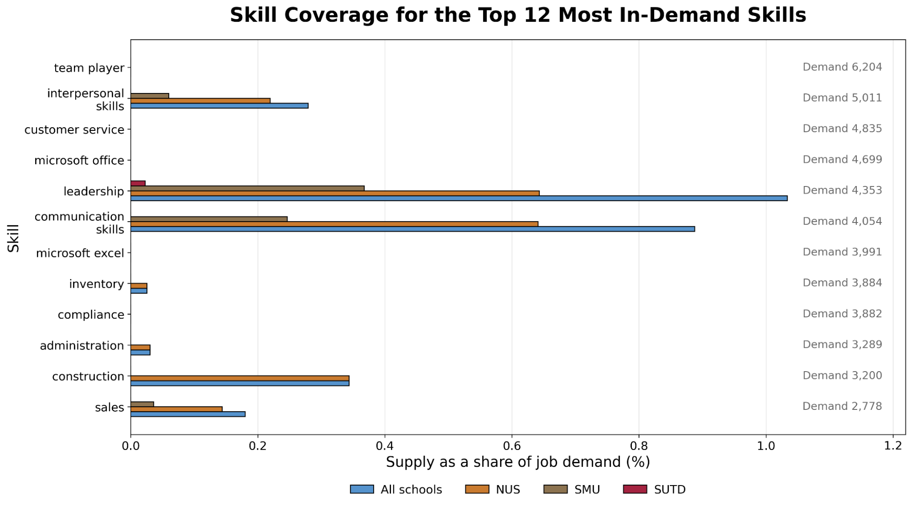

**Figure 6. Top 12 Most In-Demand Skills Coverage Bar Graph**

</div>

Even for the best-covered skills, including leadership and communication, university supply is only about **1% or less** of job demand. Coverage is highest for NUS, followed by SMU and finally, SUTD. 

**Overall**, the findings suggest that universities cover a reasonable range of unique job-demanded skills, but cover the most in-demand skills much more weakly. This pattern remains broadly consistent across robustness checks, including threshold sensitivity tests, bootstrap resampling, and a lexical exact-phrase baseline.

## 5. Micro Question

Section 5 addresses: 

**Which degrees demonstrate the strongest broad-market and intended-industry alignment?**

This micro analysis proceeds in two stages:

1. Validation of module-level predictors linked to employment outcomes
2. Degree-job alignment analysis through broad market reach and targeted market fit

### 5.1 Prerequisites

While the macro-level analysis provides a broad view of curriculum skill coverage, a critical limitation is that individual module-to-job mappings may systematically undervalue foundational modules.

**Figure 7** shows that foundational modules are left-skewed in the distribution, below the median of 0.32. In contrast, higher level modules are more sparse, with many scoring above 0.6. This pattern holds across all 10 degrees, suggesting that foundational modules undervaluation is a structural phenomenon rather than a degree-specific anomaly.

<div align="center" markdown="1">

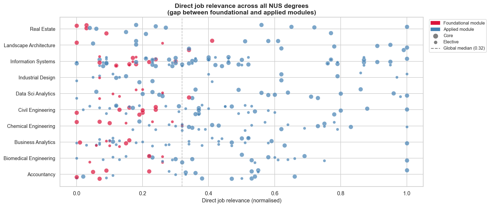

**Fig 7. Cosine Similarity Across All 10 NUS Degrees**

</div>

This presents a methodological gap: a naive direct-similarity mapping would incorrectly flag foundational modules as curriculum weaknesses. To address this methodological gap, we introduce **prerequisite breadth** defined as the number of downstream modules that structurally depend on a given module using `dependent_mods_dedup.csv` and `nus_prerequisite_graph.json`:

$$
N_{prereq}(c) = |\{c' : c \in Prereqs(c')\}|
$$

**Figure 8** plots each module along both dimensions for all 10 degrees. Across degrees, foundational modules like MNO1706 and MKT1705 in Accountancy and Real Estate, and EE2211 and MA1513 in Civil Engineering, consistently occupy the top left quadrant. Together, they suggest that a two-dimensional framework combining direct job relevance with prerequisite breadth is necessary for a complete picture. How these foundational modules are formally incorporated into our relevance scoring is addressed in the following micro-level analysis.

<div align="center" markdown="1">

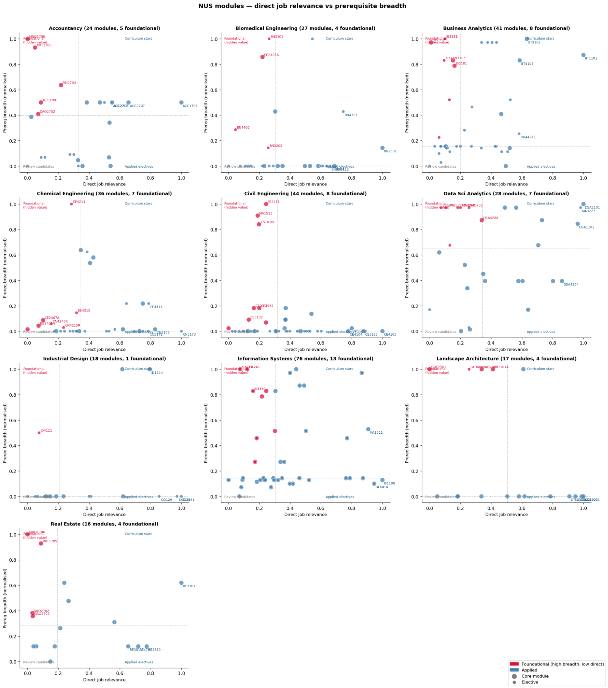

**Figure 8. Cosine Similarity Against Prerequisite Breadth Across All Degrees**

</div>

### 5.2 Module Ranking Using Validated Employment Predictors: Spearman Correlation

#### Rationale

Not all curriculum features contribute equally to graduate employment outcomes. To avoid arbitrary weighting, an approach that grounds downstream module rankings in empirical relationships was adopted: module-level signals for degree-level employment rates were identified and used to score individual modules.

#### Methodology 

**Job relevance** ($s_{\text{jobs}}$). Measures semantic cosine similarity between module descriptions and job postings (Section 3).

**Prerequisite importance** ($s_{\text{prereqs}}$; NUS only). Measures a modules' structural importance using the number of downstream modules unlocked in the prerequisite graph using breadth-first search (BFS).

$$
\mathrm{Desc}(m)=\{\,m' \in M_p \mid m' \text{ is reachable from } m \text{ in the prerequisite graph}\,\}
$$

$$
s_{\text{prereqs}}(m)=\frac{|\mathrm{Desc}(m)|}{20}
$$

**Module level** ($s_{\text{level}}$). Extracted from module codes and normalized to reflect curricular advancement.

$$
s_{\text{level}}(m)=\frac{\text{Level}(m)}{4}
$$

**Module type** (core_boost). Binary indicator distinguishing core modules (1) from electives (0).

Degree-level predictors were constructed by aggregating module-level signals within each degree. Specifically, for each degree, we computed averages for job relevance, module level, and prerequisite importance across its modules, as well as the proportion of core modules.

These degree-level predictors were correlated with GES's full-time permanent employment rates using **Spearman rank correlation**. Significant predictors were converted into normalized weights:

$$
w_i=\frac{|\rho_i|}{\sum_k |\rho_k|}
$$

Module composite scores were then computed using only validated features:

$$
\text{CompositeScore}_m=\sum_i w_i x_{mi}
$$

### 5.3 Degree-Job Alignment

#### Rationale

Degree-job alignment was evaluated at two levels: **broad market reach** for the general labour market, and **targeted market fit** for the degree's intended occupational domain.

#### Methodology 

Degree-job alignment was evaluated using weighted module-job similarity scores, where module contributions were based on the Spearman-validated weights from Section 5.2. Degree-specific target markets were defined using BERTopic clusters.

For degree $p$ and job $j$, degree-job similarity is defined as:

$$
S(p,j)=\sum_{m\in p}\tilde{w}_m\,s(m,j)
$$

where module weights are normalized within each degree:

$$
\tilde{w}_m=\frac{\text{CompositeScore}_m}{\sum_{m'\in p}\text{CompositeScore}_{m'}}
$$

A job is considered **reachable** if degree-job similarity exceeds the calibrated threshold of **0.55**:

$$
\text{Reach}(p)=\frac{1}{|J|}\sum_{j\in J}\mathbf{1}\big(S(p,j)\ge 0.55\big)
$$

#### Analysis and Results

All degrees are assessed against a shared job pool to ensure comparable cross-school evaluation. 

Module-job alignment is aggregated into degree-job scores using curriculum weights and Spearman-validated module importance. Degree performance is evaluated using indicators of alignment strength, market breadth and curricular robustness. 

The final similarity threshold is calibrated using a **Monte Carlo null procedure**. Pooled degree-job scores are compared against a structured null that preserves embedding geometry while removing semantic alignment, so null exceedances reflect chance overlap rather than meaningful correspondence. 

The observed score distribution lies to the right of the null distribution, supporting the use of high null quantiles as a specificity floor. 

To identify degree-specific relevant markets, the **Kneedle algorithm** was applied to BERTopic-matched jobs (Section 3), detecting the inflection point in degree-job similarity curves, adaptively defining thresholds where similarity drops sharply. Safety bounds (min 300, max 2000 jobs, threshold ≥0.15) prevented market dilution while ensuring statistical robustness.

Candidate thresholds are then assessed using a threshold sweep over reach and breadth retention, collapse risk, and ranking and profile stability: 

$$
t^*=\max\{t\in T: t \text{ satisfies null, stability, and retention constraints}\}
$$

**0.250** was selected as the largest admissible threshold that satisfies all null, stability and retention constraints, making it conservative, stable and defensible for public-sector comparison. 

<div align="center" markdown="1">

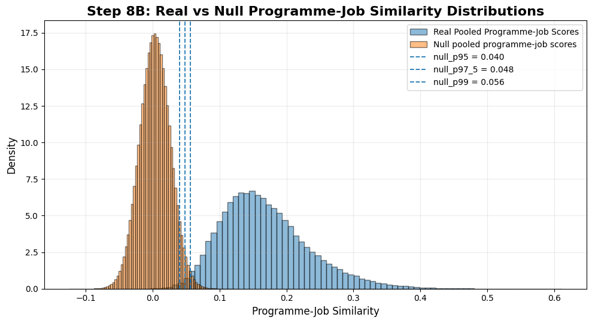

**Figure 9. Real vs Null Degree-Job Similarity Distributions**

</div>

<div align="center" markdown="1">

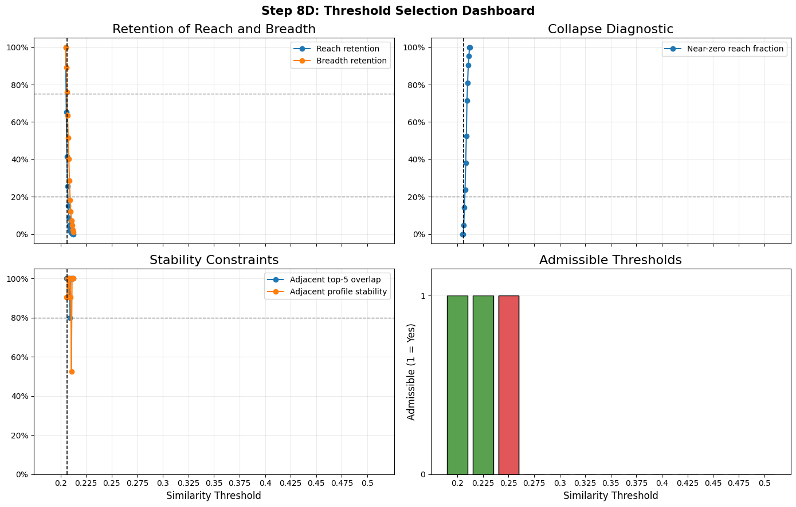

**Figure 10. Threshold Selection Dashboard**

</div>

#### Results

<div align="center" markdown="1">

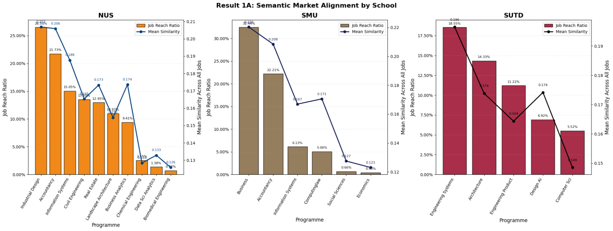

**Figure 11. Semantic Market Alignment**

</div>

- NUS Industrial Design and the Accountancy programmes are the strongest broad-market performers, with reach above 21% and mean similarity around 0.21.
- SMU Economics (0.43%, 0.123) and NUS Data Science Analytics (1.38%, 0.133) are the weakest. 

<div align="center" markdown="1">

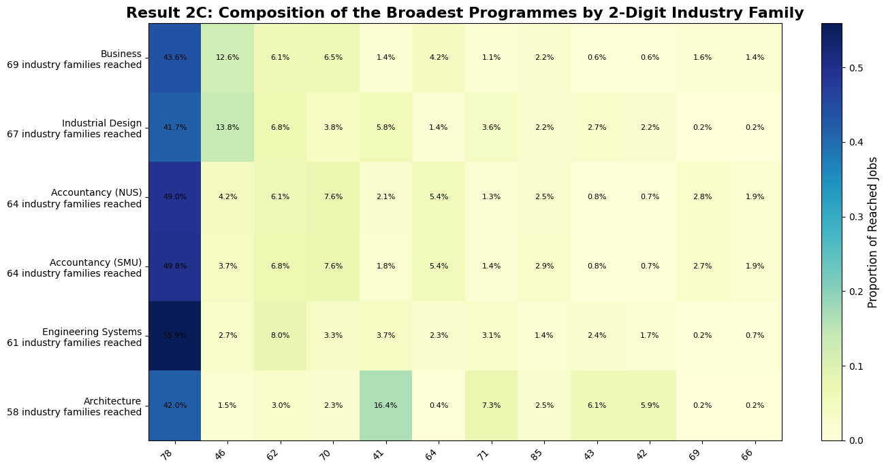

**Figure 12. Top 6 Broadest Degrees**

</div>

- SMU Business is the broadest degree, followed by NUS Industrial Design and the two Accountancy programmes.
- SUTD Architecture is relatively broad, but more concentrated in construction- and engineering-related families.

<div align="center" markdown="1">

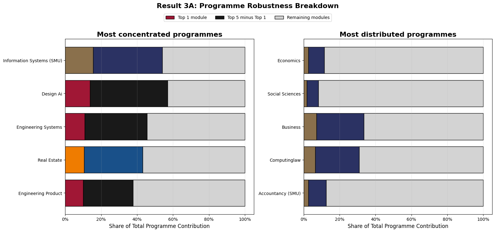

**Figure 13. Programme Robustness**

</div>

- SMU Business appears broadly robust, while SUTD Design AI and SUTD Engineering Systems are more concentrated in a small number of modules.
- These robustness patterns should be interpreted cautiously, as they depend partly on the weighting scheme used.

We next turn to **targeted market fit**, which assesses how well each degree prepares graduates for jobs in its intended field using the weighted average similarity of its top-5 matching modules per job.

These collective scores were pooled across all 21 degrees to derive preparation quality thresholds: **well-prepared** (≥67th percentile, 0.425), **moderately prepared** (33rd-67th percentile, 0.342-0.425), and **under-prepared** (<33rd percentile, 0.342).

Across the 21 degrees, substantial variation in targeted market fit was observed:

<div align="center" markdown="1">

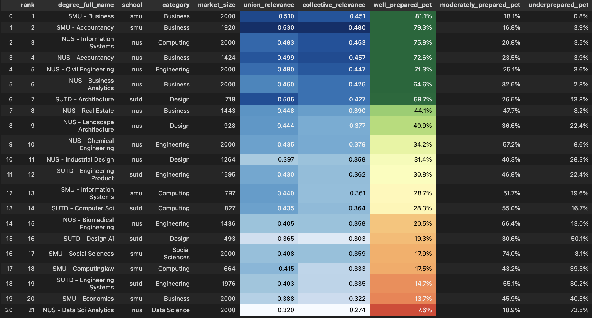

**Figure 14. Cross-degree ranking of targeted market fit**

</div>

- Business, Accountancy, and Information Systems record the highest shares of well-prepared jobs (75.8–81.1%).
- Data Science (7.6%), Economics (13.7%), and Engineering Systems (14.7%) record the lowest shares of well-prepared jobs.
- These differences suggest that degrees may face different alignment challenges and therefore may require different responses.

By field, Business degrees (mean: 59.2% well-prepared) significantly outperform Computing (37.6%) and Data Science (7.6%). This is concerning for Singapore's digital economy goals. 

<div align="center" markdown="1">

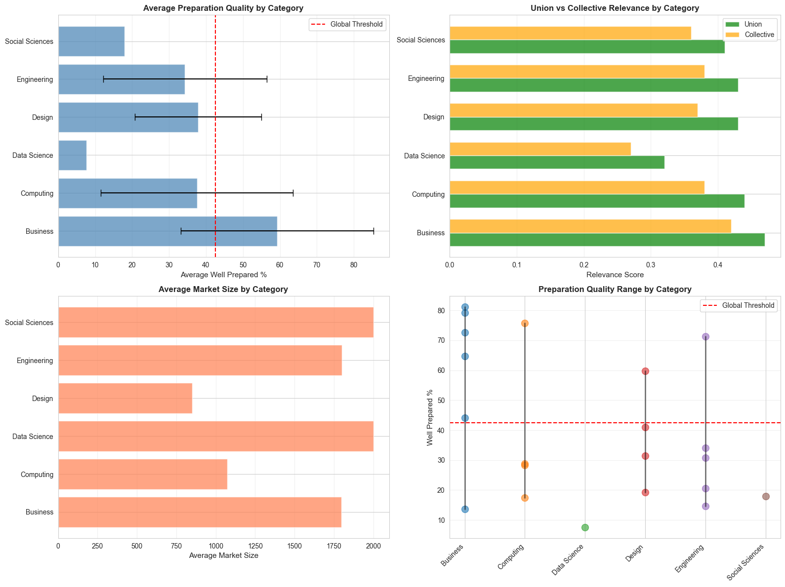

**Figure 15. Targeted market fit by academic category**

</div>

Market size showed only a weak positive correlation with preparation quality ($\rho = 0.089$), suggesting that job availability alone does not strongly predict degree readiness.

<div align="center" markdown="1">

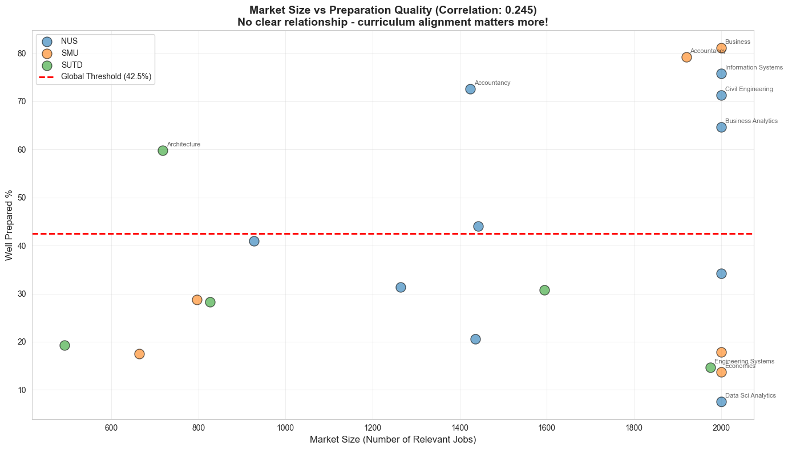

**Figure 16. Relationship between market size and targeted market fit**

</div>

## 6. Policy Recommendations 

**First**, undergraduate curricula should emphasize more on applied and project-based learning. Higher-level modules show stronger labour market alignment given their practical focus. Expanding the use of industry projects and collaborative work would enhance students' development of job-relevant skills.

**Second**, universities should strengthen existing degrees before expanding degree offerings. As NUS introduces new degrees in high-demand fields such as Robotics & Machine Intelligence and Computing in AI, they may not always be well aligned and preparation quality varies across degrees. This risks neglecting current students in misaligned programs who require immediate curriculum improvements. Policymakers and universities should prioritise refining existing curricula using degree-level evidence before introducing new degrees.

**Finally**, government-industry partnerships should be formalised to support real-time curriculum feedback. As labour market needs evolve rapidly, especially in emerging sectors, periodic curriculum reviews may be insufficient. MOE can collaborate with the Economic Development Board (EDB) to access real-time job demand data and engage key industry partners to keep curricula responsive.

## 7. Limitations

Several limitations should be acknowledged:

- Module descriptions are used as proxies for taught skills, and may not fully reflect actual content due to vague or inconsistent descriptions across institutions.
- Degree-level representation assumes exposure to all skills in the curated module list, although actual skill acquisition depends on the students' module choices. 
- Focusing mainly on core and selected modules may understate transferable, especially non-technical skills honed through common curriculum components.
- The job-posting data only provides a partial snapshot of labour demand from a single source over a limited period which may over- or under-represent certain sectors.

## 8. Future Work

Future work could address these limitations by extending the analysis to more universities and degree programmes using official administrative data, rather than incomplete or undergraduate-only public module information. Incorporating exact pathway data would also allow for more precise estimation of realised skill profiles.

Further validation could benchmark alignment measures against labour market outcomes such as employment rates, wages, or employer evaluations. A longitudinal design could also track how curriculum-labour market alignment changes over time.
